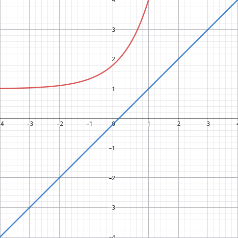

# Тема: Границі функції

## Базові формули

1. Границя кореня: 
   
$$ 
\lim_{ n \to \infty } \sqrt[n]{ n } = 1 
$$

2. Границя степеневого виразу:
   
$$
\lim_{ n \to \infty } \sqrt[n]{ n^\alpha } = \lim_{ n \to \infty } (\sqrt[n]{ n })^\alpha = \lim_{ n \to \infty }(\sqrt[n]{ n } * \sqrt[n]{ n } \dots * \sqrt[n]{ n }) = 1
$$

3. Границя дробу:

$$
\lim_{ n \to \infty } \frac{n^\alpha}{a^n} = 0, \quad a>1, \alpha>0
$$

4. Границя суми:

$$
\lim_{ n \to \infty } x_{n} = a, \quad \lim_{ n \to \infty }y_{n}  = b
$$

$$
\lim_{ n \to \infty } (x_{n}\pm y_{n}) = a+b
$$

5. Границя добутку:

$$
\lim_{ n \to \infty } (x_{n}*y_{n}) = a*b
$$

6. Границя частки:

$$
\lim_{ n \to \infty } \frac{x_{n}}{y_{n}} = \frac{a}{b}, b \neq 0
$$

7. Границя добутку з константою

$$
\lim_{ n \to \infty } (C * x_{n}) = C*\lim_{ n \to \infty } x_{n} = c*a
$$

8. Границя добутку з факторіалом:

$$
\lim_{ n \to \infty } \frac{a^n}{n!} = 0
$$

9. Границя степеневого виразу з факторіалом:

$$
\lim_{ n \to \infty } \frac{n^\alpha}{n!} = 0
$$

## Завдання 1

Знайти границю:

$$
\lim_{ n \to \infty } \sqrt[n]{ 2^n + n + 1 }
$$

Розв'язок:

$$
\lim_{ n \to \infty } \sqrt[n]{ 2^n + n + 1 } = \lim_{ n \to \infty } \left( \sqrt[n]{2^n\left( 1+\frac{n}{2^n} + \frac{1}{2^n} \right)  } \right) = \lim_{ n \to \infty } 2 \sqrt[n]{ 1 + \frac{n}{2^n} + \frac{1}{2^n} } = 2
$$

*Пояснення*: Використовуємо властивості коренів та границь для спрощення виразу.

## Завдання 2

Знайти границю:

$$
\lim_{ n \to \infty } (\sqrt[3]{ (n+1)^2 } - \sqrt[3]{ (n-1)^2 })
$$

Бачимо, що це неповний вираз кубічного рівняння:

$$
a^3-b^3 = (a-b)(a^2 + ab + b^2)
$$

Розв'язок:

$$
\lim_{ n \to \infty } (\sqrt[3]{ (n+1)^2 } - \sqrt[3]{ (n-1)^2 }) = 
$$

$$
= \lim_{ n \to \infty } \frac{(\sqrt[3]{ (n+1)^2 } - \sqrt[3]{ (n-1)^2 })((\sqrt[3]{ (n+1)^2 })^2 + (\sqrt[3]{ (n+1)^2(n-1)^2 }) + \sqrt[3]{ (n-1)^4 })}{(\sqrt[3]{ (n+1)^4 } + \sqrt[3]{ (n+1)^2(n-1)^2 } + \sqrt[3]{ (n-1)^4 })} =
$$

$$
= \lim_{ n \to \infty } \frac{(n+1)^2-(n-1)^2}{\sqrt[3]{ (n-1)^4 } + \sqrt[3]{ (n+1)^2(n-1)^2 } + (\sqrt[3]{ n-1 })^4} = 
$$

$$
= \lim_{ n \to \infty } \frac{4n}{n( \sqrt[3]{ ( n^( \frac{1}{4} ) - \frac{1}{n^( \frac{3}{4} )} )^4 } ) + ( \sqrt[3]{ n^( \frac{1}{2} ) - \frac{1}{n^( \frac{3}{2} )} } ) + ( \sqrt[3]{ n^( \frac{1}{4} ) } - \frac{1}{n^( \frac{3}{4} )} )^4} = 0
$$

## Завдання 3

Знайти границю:

$$
\lim_{ n \to \infty } (\sqrt[n]{ 6n^2 + 5n })
$$

Розв'язок:

$$
\lim_{ n \to \infty } (\sqrt[n]{ 6n^2 + 5n }) = \lim_{ n \to \infty } \left( \sqrt[n]{ n^2 \left( 6 + \frac{5}{n} \right) } \right) = 6^0 = 1
$$
