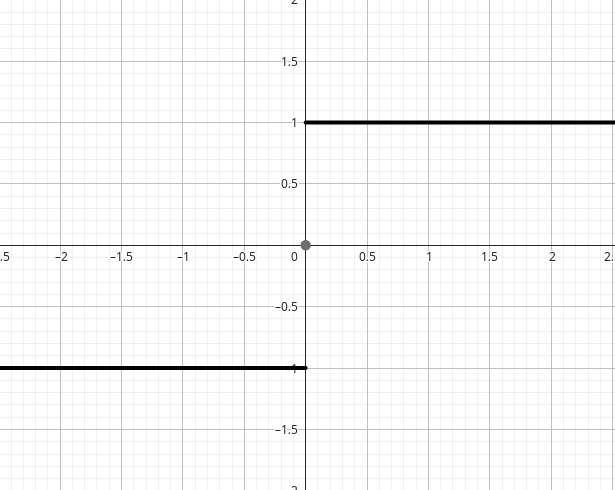

# Тема: Функції дійсної змінної

## 1. Означення та основні поняття
Нехай $X$ та $Y$ — це довільні числові множини.  
Скажемо, що на множині $X$ визначена функція з множиною значень у $Y$, якщо задано правило, за яким кожному елементу $x \in X$ ставиться у відповідність єдиний елемент $y \in Y$.  

Позначається цей факт $y = f(x)$ або $f: x \mapsto y$.  
При цьому елемент $y \in Y$ називається **образом** елемента $x \in X$, а $x$ — **прообразом** елемента $y \in Y$.

Нехай $A \subset X$, тоді множину  

$$
f(A) = \{ y \in Y : y=f(x), \; x \in A \}
$$  

назвемо образом множини $A$.  

Нехай $B \subset Y$, тоді множину 

$$
f^{-1}(B) = \{ x \in X : f(x) \in B \}
$$  

назвемо прообразом множини $B$.  

- Якщо $f(X) \subset Y$, то відображення $f$ назвемо **відображенням "в"** або **ін'єкцією**.  
- Якщо $f(X) = Y$, то відображення назвемо **"на"** або **сур'єкцією**.  
- Відображення $f: x \mapsto y$ назвемо **взаємно однозначним**, якщо різним елементам з множини $X$ відповідають різні елементи з множини $Y$:  

$$
\forall x_{1}, x_{2} \in X, \; x_{1} \neq x_{2} \implies f(x_{1}) \neq f(x_{2})
$$

Якщо відображення $f$ є взаємно однозначним та "на" (сур'єкцією), то воно називається **бієктивним (бієкцією)**.  
Бієктивне відображення є оборотним (тобто для нього завжди існує обернене).

---

## 2. Границя функції

Розглянемо границю функції $y=f(x)$, визначену на $x \in X$.  
І нехай точка $a$ в будь-якому своєму околі містить принаймні один елемент $x \in X, \; x \neq a$.

**Означення (за Гейне).**  
Число $b$ називається границею функції $f(x)$ в точці $x=a$ ($x \to a$), якщо для довільної послідовності $x_{n}$, збіжної до числа $a$ та тотожно не рівної числу $a$, відповідна послідовність значень функції $\{f(x_{n})\}$ є збіжною до $b$:

$$
\forall \{x_{n}\}, \; x_{n} \to a, \; x_{n} \neq a \implies f(x_{n}) \to b \quad (n \to \infty)
$$

Послідовність $f(x_{n})$ має бути збіжною, отже вона має мати єдину границю.  
Число $b$ називають **граничним значенням функції** в точці $x=a$.

Не будь-яка функція завжди має границю в деякій точці.  
Наприклад, якщо розглянути **функцію Діріхле**:  

$$
f(x) =
\begin{cases}
-1, & x<0, \\
0, & x=0, \\
1, & x>0,
\end{cases}
$$  

та взяти $a \neq 0$ й вибирати послідовність $\{x_{n}\}$, що наближає число $a$:  
- якщо брати лише раціональні числа, то $f(x_{n}) \to 1$,  
- якщо брати ірраціональні, то $f(x_{n}) \to 0$.  

Тобто така функція в точці $a \neq 0$ границі не має.

---

### Односторонні границі
Нехай $\forall \epsilon > 0$ інтервал $(a, a+\epsilon)$ (або $(a-\epsilon, a)$) містить хоча б одну точку з $X$.  

Число $b$ назвемо **правосторонньою** (відповідно, **лівосторонньою**) границею $f(x)$ в точці $x=a$, якщо:  

- для $\{x_{n}\}, \; x_{n} > a, \; x_{n}\to a \implies f(x_{n}) \to b$,  
- для $\{x_{n}\}, \; x_{n} < a, \; x_{n}\to a \implies f(x_{n}) \to b$.

Позначення:  

$$
f(a+0) = \lim_{x \to a+0} f(x), \quad f(a-0) = \lim_{x \to a-0} f(x)
$$
	
**Приклад:**  

$$
f(x) =
\operatorname{sign}(x) =
\begin{cases}
-1, & x<0, \\
0, & x=0, \\
1, & x>0
\end{cases}
$$

**Зображення:**

Якщо в точці $a$ односторонні границі співпадають, то функція має границю в цій точці.

---

### Границя на нескінченності
Розглянемо $A > 0$ і нехай $X$ містить принаймні одну точку поза відрізком $[-A, A]$.  
Число $b$ назвемо границею функції $f(x)$ при $x \to +\infty$, якщо для довільної нескінченно великої послідовності $\{x_{n}\}$  

$$
x_{n} \to +\infty \implies f(x_{n}) \to b
$$

---

### Означення за Коші
Нехай $x_{0}$ — це гранична точка множини $X$, на якій визначена $f(x)$.  

Число $b$ називається границею функції при $x \to x_{0}$, якщо:

$$
\forall \varepsilon > 0 \; \exists \delta > 0: \; 0<|x-x_{0}|<\delta \implies |f(x)-b|<\varepsilon
$$

Аналогічно:  
- якщо $x \to +\infty$, то $\forall \varepsilon > 0 \; \exists C \in \mathbb{R}$: $\forall x > C \implies |f(x)-b| < \varepsilon$,  
- якщо $x \to -\infty$, то $\forall \varepsilon > 0 \; \exists C \in \mathbb{R}$: $\forall x < C \implies |f(x)-b| < \varepsilon$.

---

### Нескінченна границя
Нехай $x_{0}$ — гранична точка множини $X$, на якій визначена функція $f(x)$.  

Значення $+\infty$ називається границею $f(x)$ в точці $x_{0}$, якщо:  

$$
\forall C \in \mathbb{R}^+ \; \exists \delta_C > 0 : \; 0 < |x-x_{0}| < \delta_C \implies f(x) > C
$$

Відповідно, $-\infty$ буде границею, якщо:  

$$
\forall C \in \mathbb{R}^- \; \exists \delta_C > 0 : \; 0 < |x-x_{0}| < \delta_C \implies f(x) < C
$$

---

### Теорема (про еквівалентність границь за Коші та Гейне)
Означення границі функції за Коші та Гейне є еквівалентними.  

**(⇒) Доведення (необхіднійсть). Нехай $f(x)$ має границю $b$ в точці $x_{0}$ за Гейне.**  

$$
\forall \{x_{n}\}, \; x_{n} \to x_{0}, \; x_{n}\neq x_{0} \implies f(x_{n}) \to b
$$

Припустимо, що означення за Коші не виконується.  
Тоді  

$$
\exists \varepsilon_0 > 0 : \forall \delta > 0, \; \exists x \in X, \; 0<|x-x_{0}|<\delta, \; |f(x)-b|\geq \varepsilon_0
$$

Виберемо послідовність $x_{n}$ таку, що $|x_{n}-x_{0}| \leq \tfrac{1}{n}$.  
Отримуємо суперечність із $f(x_{n}) \to b$.  

**(⇐) Доведення (достатність). Нехай $f(x)$ має границю $b$ в точці $x_{0}$ за Коші.**  
Покажемо, що вона існує і за Гейне.

Нехай $\{x_{n}\}$ — довільна послідовність, що збігається до $x_{0}$ і $x_{n} \neq x_{0}$ для всіх $n$.  
Треба показати, що $f(x_{n}) \to b$.

За означенням границі за Коші: 

$$
\forall \varepsilon > 0 \; \exists \delta > 0 : \; 0 < |x - x_{0}| < \delta \implies |f(x)-b| < \varepsilon
$$

Оскільки $x_{n} \to x_{0}$, то $\exists N: \forall n > N \; |x_{n}-x_{0}| < \delta$.  
Тоді для всіх $n > N$:  

$$
|f(x_{n}) - b| < \varepsilon
$$

Отже, $f(x_{n}) \to b$. Це і є означення границі за Гейне.  

Таким чином, означення границі за Коші та за Гейне є еквівалентними.

